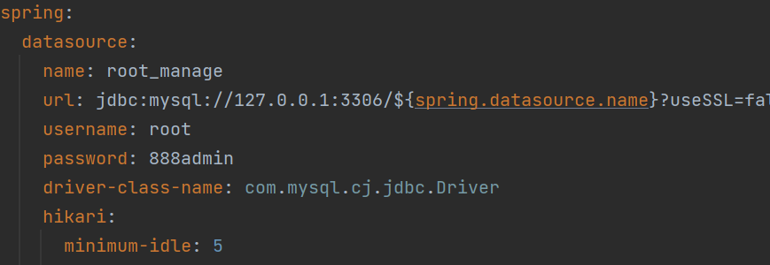
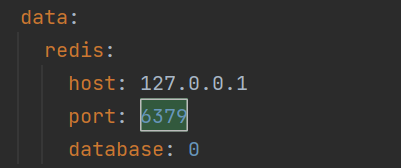

# 环境部署

## 后端部署

### 1. 准备工作

```
JDK >= 17
Mysql >= 8.0
Maven >= 3.0
```

### 2. 初始化 MySQL

- 创建一个数据库， 数据库名、密码、端口要和 application-local.yaml 一致，如果不一致可以修改 application-local.yaml
  

### 3. 初始化 Redis

- 默认配置下，Redis 启动在 6379 端口，不设置账号密码。如果不一致，需要修改 application-local.yaml 配置文件。
  

### 4. 运行系统

- 使用 IDEA 打开 backend 文件夹，耐心等待 Maven 下载完相关的依赖
- 执行 ServerApplication 类，进行启动

## 前端部署

- 使用 vsCode 打开 frontend 文件夹
- 打开终端执行以下命令

```
# 安装 pnpm，提升依赖的安装速度
npm config set registry https://registry.npmmirror.com
npm install -g pnpm
# 安装依赖
pnpm install

# 启动服务
npm run dev
```

- 启动完成后，浏览器会自动打开 http://localhost:80 地址，可以看到前端界面
