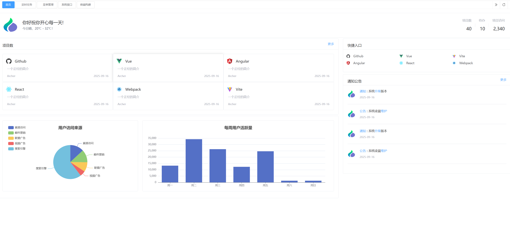
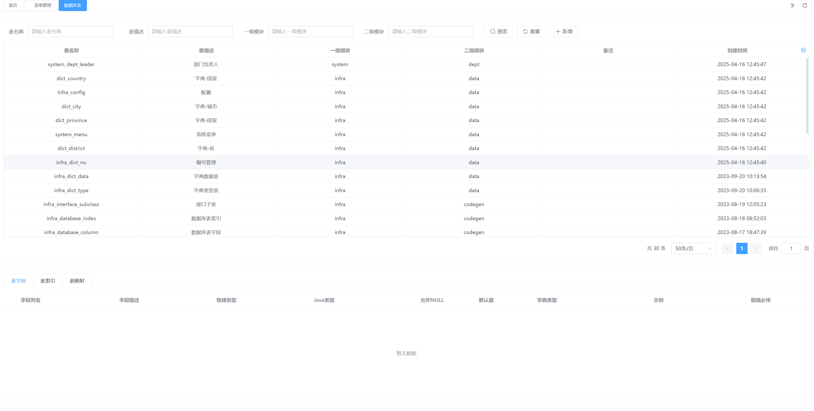
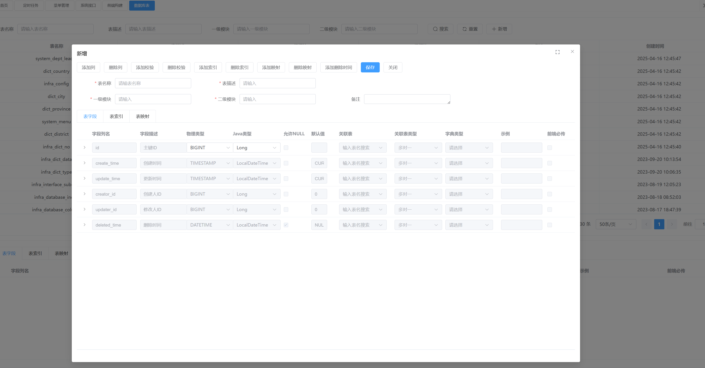
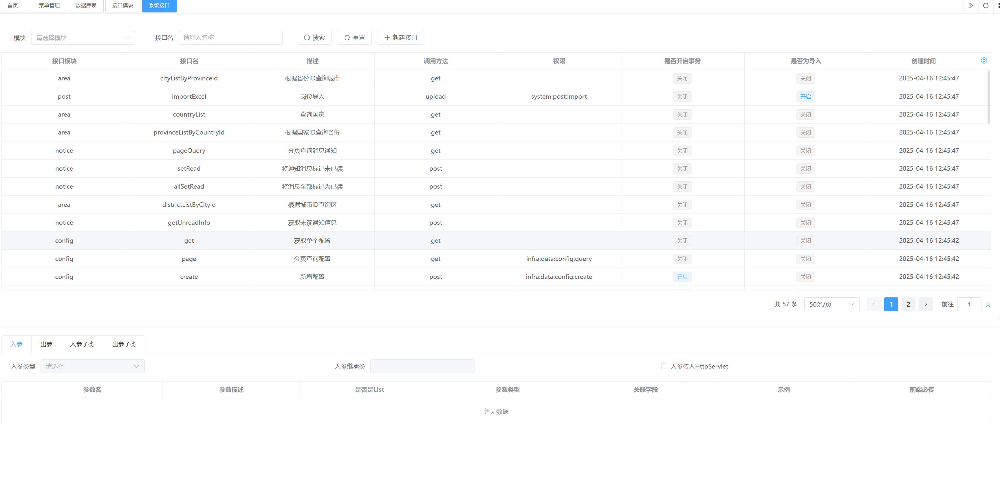
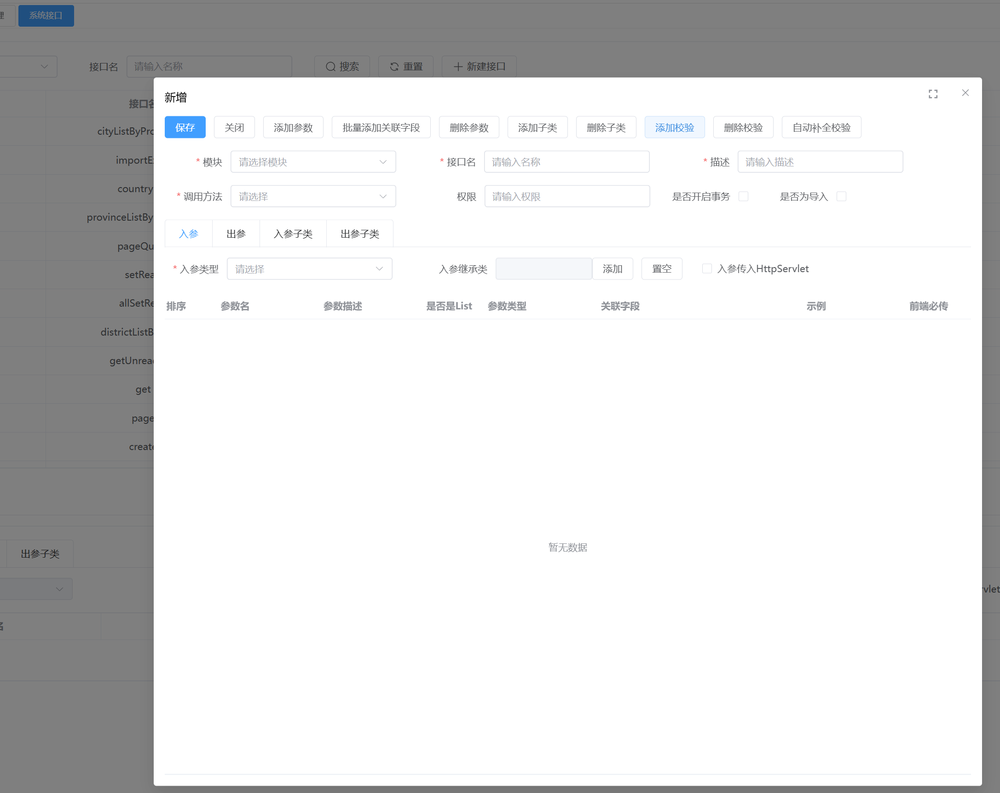

	

<h1 align="center" style="margin: 30px 0 30px; font-weight: bold;">XiYu v0.0.1</h1>
<h4 align="center">基于SpringBoot开发的后台管理系统脚手架</h4>

## ✨ 核心亮点

1. 代码生成：
   - 后端支持添加、修改、删除接口、数据库表，代码自动生成，并自动生成 sql 文件，无需手动维护
   - 前端支持管理页面、编辑页面的模板快速生成
2. 菜单管理、字典管理、定时任务等功能支持自动生成 sql 文件，无需手动维护
3. 前端参考 pure-admin 前端框架，重写优化了 Table、InputNumber 等组件

## 🛠️ 技术架构

- **后端技术**：

| 框架                                                                                        | 说明                 | 版本           |
| ------------------------------------------------------------------------------------------- | -------------------- | -------------- |
| [Spring Boot](https://spring.io/projects/spring-boot)                                       | 应用开发框架         | 3.4.1          |
| [MySQL](https://www.mysql.com/cn/)                                                          | 数据库服务器         | 8.0+           |
| [Jimmer](https://github.com/babyfish-ct/jimmer)                                             | ORM 框架             | 0.9.9          |
| [Dynamic Datasource](https://dynamic-datasource.com/)                                       | 动态数据源           | 3.6.1          |
| [Redis](https://redis.io/)                                                                  | 内存数据库           | 5.0 / 6.0 /7.0 |
| [Redisson](https://github.com/redisson/redisson)                                            | Redis 客户端         | 3.4.1          |
| [Spring MVC](https://github.com/spring-projects/spring-framework/tree/master/spring-webmvc) | MVC 框架             | 2.7.0          |
| [Spring Security](https://github.com/spring-projects/spring-security)                       | Spring 安全框架      | 3.4.1          |
| [Hibernate Validator](https://github.com/hibernate/hibernate-validator)                     | 参数校验组件         | 6.2.5          |
| [Flyway](https://github.com/flyway/flyway)                                                  | 数据库版本控制       | 11.1.0         |
| [Quartz](https://github.com/quartz-scheduler)                                               | 任务调度组件         | 2.3.2          |
| [Springdoc](https://springdoc.org/)                                                         | Swagger 文档         | 1.7.0          |
| [Spring Boot Admin](https://github.com/codecentric/spring-boot-admin)                       | Spring Boot 监控平台 | 2.7.10         |
| [Jackson](https://github.com/FasterXML/jackson)                                             | JSON 工具库          | 2.13.5         |
| [MapStruct](https://mapstruct.org/)                                                         | Java Bean 转换       | 1.5.3          |
| [Lombok](https://projectlombok.org/)                                                        | 消除冗长的 Java 代码 | 1.18.34        |
| [JUnit](https://junit.org/junit5/)                                                          | Java 单元测试框架    | 5.8.2          |

- **前端技术**
  | 框架 | 说明 | 版本 |
  |----------------------------------------------------------------------|------------------|--------|
  | [Vue](https://staging-cn.vuejs.org/) | Vue 框架 | 3.2.47 |
  | [Vite](https://cn.vitejs.dev//) | 开发与构建工具 | 4.2.1 |
  | [Element Plus](https://element-plus.org/zh-CN/) | Element Plus | 2.9.3 |
  | [TypeScript](https://www.typescriptlang.org/docs/) | JavaScript 的超集 | 5.0.2 |
  | [pinia](https://pinia.vuejs.org/) | Vue 存储库 替代 vuex5 | 2.0.34 |
  | [vueuse](https://vueuse.org/) | 常用工具集 | 9.13.0 |
  | [vue-i18n](https://kazupon.github.io/vue-i18n/zh/introduction.html/) | 国际化 | 9.2.2 |
  | [vue-router](https://router.vuejs.org/) | Vue 路由 | 4.1.6 |
  | [iconify](https://icon-sets.iconify.design/) | 在线图标库 | 3.1.0 |
  | [tinymce](https://www.wangeditor.com/) | 富文本编辑器 | 6.8.5 |

## 🌟 内置功能

1.  用户管理：用户是系统操作者，该功能主要完成系统用户配置。
2.  部门管理：配置系统组织机构（公司、部门、小组），树结构展现支持数据权限。
3.  岗位管理：配置系统用户所属担任职务。
4.  菜单管理：配置系统菜单，操作权限，按钮权限标识等。
5.  角色管理：角色菜单权限分配、设置角色按机构进行数据范围权限划分。
6.  字典管理：对系统中经常使用的一些较为固定的数据进行维护。
7.  参数管理：对系统动态配置常用参数。
8.  通知公告：系统通知公告信息发布维护。
9.  操作日志：系统正常操作日志记录和查询；系统异常信息日志记录和查询。
10. 登录日志：系统登录日志记录查询包含登录异常。
11. 在线用户：当前系统中活跃用户状态监控。
12. 定时任务：在线（添加、修改、删除)任务调度包含执行结果日志。
13. 代码生成：前后端代码的生成（java、html、xml、sql）支持 CRUD 下载 。
14. 系统接口：根据业务代码自动生成相关的 api 接口文档。
15. 服务监控：监视当前系统 CPU、内存、磁盘、堆栈等相关信息。
16. 缓存监控：对系统的缓存查询，删除、清空等操作。
17. 在线构建器：拖动表单元素生成相应的 HTML 代码。
18. 连接池监视：监视当前系统数据库连接池状态，可进行分析 SQL 找出系统性能瓶颈。

## 🚀 在线体验

演示地址：http://ruoyi.vip

## 📚 演示图

<table>
    <tr>
        <td></td>
        <td></td>
    </tr>
    <tr>
        <td></td>
        <td></td>
    </tr>
    <tr>
        <td></td>
        <td></td>
    </tr>
	
</table>

## 交流群

QQ 群： 
