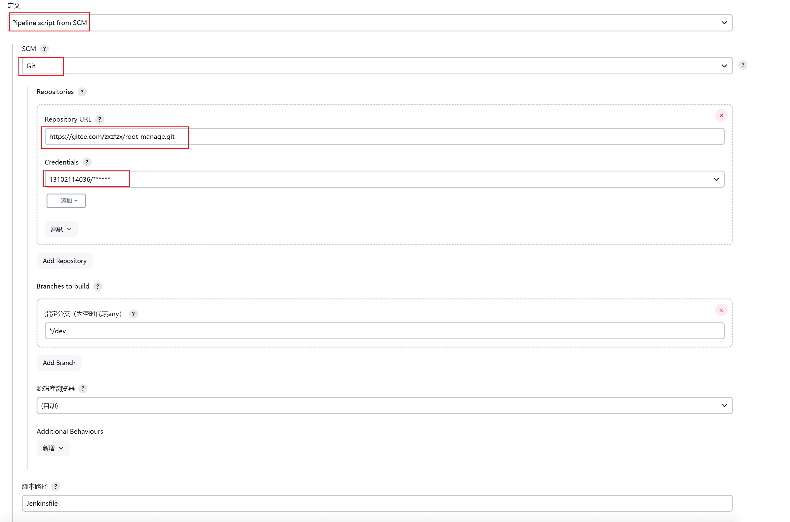
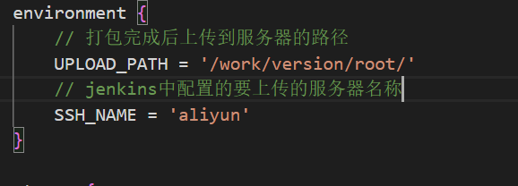

# 打包部署

## 打包

### 1. 手动打包

#### 后端打包

- 在 IDEA 打开 backend 文件夹，并打开终端执行命令

```
mvn clean package -T 1C -Dmaven.test.skip=true -Dmaven.compile.fork-true
```

- 打包完毕会在 backend\xiyu-server\target 文件夹下生成 xiyu-server.jar

#### 前端打包

- 在 VsCode 打开 frontend 文件夹, 并打开终端执行命令

```
npm run build:dev
```

-- 打包完毕会在 frontend 生成 dist-dev 文件夹

## 2. jenkis 打包

#### 准备工作

- 安装 jenkis
- 配置 maven、git、要上传的服务器

#### 创建项目

- 在 jenkis 中新建一个 pipeline 项目，流水线选择 pipeline script from SCM, SCM 选择 git，并配置 git 的 URL 和分支，如下图

  

- 在执行项目前，修改项目中的 JenkinsFile 文件中的
  

- 进入 pipeline 项目，点击 Build Now 按钮执行

## 部署

#### 准备工作

- 安装 mysql、redis、jdk，版本和编译环境的版本保持一致
- 安装 nginx
- 安装 tomcat

#### 前端部署

- 将打包好的 dist-dev 文件放到服务器的 nginx 的 www 路径下（其他文件夹路径也可以），将 dist-dev 文件夹名改成 root-client
- 执行命令 修改文件夹所属人

```
chown nginx:nginx root-client/
```

- 配置 nginx，打开 nginx.conf,修改后执行命令重新加载 nginx 配置

```
nginx -s reload
```

#### 后端部署

- 上传 xiyu-server.jar和deploy.sh文件,将xiyu-server.jar重命名为root-server.jar
- 执行命令
```
sh deploy.sh
```