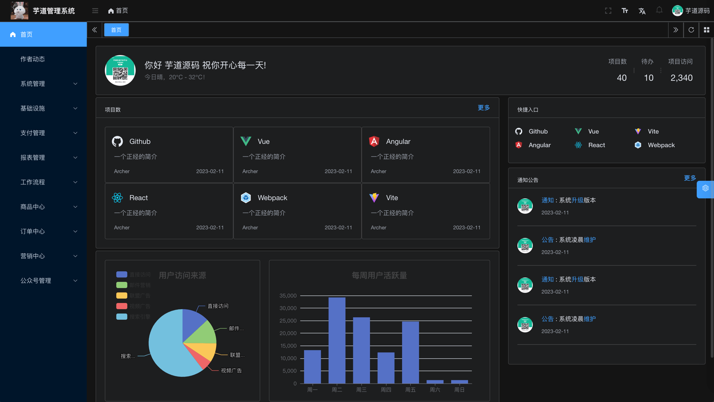

**严肃声明：现在、未来都不会有商业版本，所有代码全部开源!！**

**「我喜欢写代码，乐此不疲」**  
**「我喜欢做开源，以此为乐」**

我 🐶 在上海艰苦奋斗，早中晚在 top3 大厂认真搬砖，夜里为开源做贡献。

如果这个项目让你有所收获，记得 Star 关注哦，这对我是非常不错的鼓励与支持。

## 🐶 新手必读

- nodejs > 16.0.0 && pnpm > 7.30.0
- 演示地址【Vue3 + element-plus】：<http://dashboard-vue3.yudao.iocoder.cn>
- 演示地址【Vue2 + element-ui】：<http://dashboard.yudao.iocoder.cn>
- 启动文档：<https://doc.iocoder.cn/quick-start/>
- 视频教程：<https://doc.iocoder.cn/video/>

## 🐯 平台简介

**芋道**，以开发者为中心，打造中国第一流的快速开发平台，全部开源，个人与企业可 100% 免费使用。

- 采用 [vue-element-plus-admin](https://gitee.com/kailong110120130/vue-element-plus-admin)
- 改换 saas，自动引入等功能 [vue-element-plus-admin](https://gitee.com/yudaocode/vue-element-plus-admin)
- 使用 Element Plus 免费开源的中后台模版，具备如下特性：

- **最新技术栈**：使用 Vue3、Vite4 等前端前沿技术开发
- **TypeScript**: 应用程序级 JavaScript 的语言
- **主题**: 可配置的主题
- **国际化**：内置完善的国际化方案
- **权限**：内置完善的动态路由权限生成方案
- **组件**：二次封装了多个常用的组件
- **示例**：内置丰富的示例

## 技术栈

| 框架 | 说明 | 版本 |
| --- | --- | --- |
| [Vue](https://staging-cn.vuejs.org/) | Vue 框架 | 3.2.47 |
| [Vite](https://cn.vitejs.dev//) | 开发与构建工具 | 4.1.4 |
| [Element Plus](https://element-plus.org/zh-CN/) | Element Plus | 2.2.34 |
| [TypeScript](https://www.typescriptlang.org/docs/) | JavaScript 的超集 | 4.9.5 |
| [pinia](https://pinia.vuejs.org/) | Vue 存储库 替代 vuex5 | 2.0.33 |
| [vueuse](https://vueuse.org/) | 常用工具集 | 9.13.0 |
| [vue-i18n](https://kazupon.github.io/vue-i18n/zh/introduction.html/) | 国际化 | 9.2.2 |
| [vue-router](https://router.vuejs.org/) | Vue 路由 | 4.1.6 |
| [windicss](https://cn.windicss.org/) | 下一代工具优先的 CSS 框架 | 3.5.6 |
| [iconify](https://icon-sets.iconify.design/) | 在线图标库 | 3.1.0 |

## 开发工具

推荐 VS Code 开发，配合插件如下：

| 插件名                        | 功能                                             |
| ----------------------------- | ------------------------------------------------ |
| TypeScript Vue Plugin (Volar) | 用于 TypeScript 的 Vue 插件                      |
| Vue Language Features (Volar) | Vue3.0 语法支持                                  |
| WindiCSS IntelliSense         | 自动完成、语法突出显示、代码折叠和构建等高级功能 |
| Iconify IntelliSense          | Iconify 预览和搜索                               |
| i18n Ally                     | 国际化智能提示                                   |
| Stylelint                     | Css 格式化                                       |
| Prettier                      | 代码格式化                                       |
| ESLint                        | 脚本代码检查                                     |
| DotENV                        | env 文件高亮                                     |

## 内置功能

系统内置多种多种业务功能，可以用于快速你的业务系统：

- 系统功能
- 基础设施
- 工作流程
- 支付系统
- 会员中心
- 数据报表
- 商城系统
- 微信公众号

### 系统功能

|     | 功能       | 描述                                                           |
| --- | ---------- | -------------------------------------------------------------- |
|     | 用户管理   | 用户是系统操作者，该功能主要完成系统用户配置                   |
| ⭐️ | 在线用户   | 当前系统中活跃用户状态监控，支持手动踢下线                     |
|     | 角色管理   | 角色菜单权限分配、设置角色按机构进行数据范围权限划分           |
|     | 菜单管理   | 配置系统菜单、操作权限、按钮权限标识等，本地缓存提供性能       |
|     | 部门管理   | 配置系统组织机构（公司、部门、小组），树结构展现支持数据权限   |
|     | 岗位管理   | 配置系统用户所属担任职务                                       |
| 🚀  | 租户管理   | 配置系统租户，支持 SaaS 场景下的多租户功能                     |
| 🚀  | 租户套餐   | 配置租户套餐，自定每个租户的菜单、操作、按钮的权限             |
|     | 字典管理   | 对系统中经常使用的一些较为固定的数据进行维护                   |
| 🚀  | 短信管理   | 短信渠道、短息模板、短信日志，对接阿里云、腾讯云等主流短信平台 |
| 🚀  | 邮件管理   | 邮箱账号、邮件模版、邮件发送日志，支持所有邮件平台             |
| 🚀  | 站内信     | 系统内的消息通知，提供站内信模版、站内信消息                   |
| 🚀  | 操作日志   | 系统正常操作日志记录和查询，集成 Swagger 生成日志内容          |
| ⭐️ | 登录日志   | 系统登录日志记录查询，包含登录异常                             |
| 🚀  | 错误码管理 | 系统所有错误码的管理，可在线修改错误提示，无需重启服务         |
|     | 通知公告   | 系统通知公告信息发布维护                                       |
| 🚀  | 敏感词     | 配置系统敏感词，支持标签分组                                   |
| 🚀  | 应用管理   | 管理 SSO 单点登录的应用，支持多种 OAuth2 授权方式              |
| 🚀  | 地区管理   | 展示省份、城市、区镇等城市信息，支持 IP 对应城市               |

### 工作流程

|     | 功能     | 描述                                                                         |
| --- | -------- | ---------------------------------------------------------------------------- |
| 🚀  | 流程模型 | 配置工作流的流程模型，支持文件导入与在线设计流程图，提供 7 种任务分配规则    |
| 🚀  | 流程表单 | 拖动表单元素生成相应的工作流表单，覆盖 Element UI 所有的表单组件             |
| 🚀  | 用户分组 | 自定义用户分组，可用于工作流的审批分组                                       |
| 🚀  | 我的流程 | 查看我发起的工作流程，支持新建、取消流程等操作，高亮流程图、审批时间线       |
| 🚀  | 待办任务 | 查看自己【未】审批的工作任务，支持通过、不通过、转发、委派、退回等操作       |
| 🚀  | 已办任务 | 查看自己【已】审批的工作任务，未来会支持回退操作                             |
| 🚀  | OA 请假  | 作为业务自定义接入工作流的使用示例，只需创建请求对应的工作流程，即可进行审批 |

### 支付系统

|     | 功能     | 描述                                               |
| --- | -------- | -------------------------------------------------- |
| 🚀  | 商户信息 | 管理商户信息，支持 Saas 场景下的多商户功能         |
| 🚀  | 应用信息 | 配置商户的应用信息，对接支付宝、微信等多个支付渠道 |
| 🚀  | 支付订单 | 查看用户发起的支付宝、微信等的【支付】订单         |
| 🚀  | 退款订单 | 查看用户发起的支付宝、微信等的【退款】订单         |

ps：核心功能已经实现，正在对接微信小程序中...

### 基础设施

|     | 功能       | 描述                                                                      |
| --- | ---------- | ------------------------------------------------------------------------- |
| 🚀  | 代码生成   | 前后端代码的生成（Java、Vue、SQL、单元测试），支持 CRUD 下载              |
| 🚀  | 系统接口   | 基于 Swagger 自动生成相关的 RESTful API 接口文档                          |
| 🚀  | 数据库文档 | 基于 Screw 自动生成数据库文档，支持导出 Word、HTML、MD 格式               |
|     | 表单构建   | 拖动表单元素生成相应的 HTML 代码，支持导出 JSON、Vue 文件                 |
| 🚀  | 配置管理   | 对系统动态配置常用参数，支持 SpringBoot 加载                              |
| ⭐️ | 定时任务   | 在线（添加、修改、删除)任务调度包含执行结果日志                           |
| 🚀  | 文件服务   | 支持将文件存储到 S3（MinIO、阿里云、腾讯云、七牛云）、本地、FTP、数据库等 |
| 🚀  | API 日志   | 包括 RESTful API 访问日志、异常日志两部分，方便排查 API 相关的问题        |
|     | MySQL 监控 | 监视当前系统数据库连接池状态，可进行分析 SQL 找出系统性能瓶颈             |
|     | Redis 监控 | 监控 Redis 数据库的使用情况，使用的 Redis Key 管理                        |
| 🚀  | 消息队列   | 基于 Redis 实现消息队列，Stream 提供集群消费，Pub/Sub 提供广播消费        |
| 🚀  | Java 监控  | 基于 Spring Boot Admin 实现 Java 应用的监控                               |
| 🚀  | 链路追踪   | 接入 SkyWalking 组件，实现链路追踪                                        |
| 🚀  | 日志中心   | 接入 SkyWalking 组件，实现日志中心                                        |
| 🚀  | 分布式锁   | 基于 Redis 实现分布式锁，满足并发场景                                     |
| 🚀  | 幂等组件   | 基于 Redis 实现幂等组件，解决重复请求问题                                 |
| 🚀  | 服务保障   | 基于 Resilience4j 实现服务的稳定性，包括限流、熔断等功能                  |
| 🚀  | 日志服务   | 轻量级日志中心，查看远程服务器的日志                                      |
| 🚀  | 单元测试   | 基于 JUnit + Mockito 实现单元测试，保证功能的正确性、代码的质量等         |

### 数据报表

|     | 功能       | 描述                                 |
| --- | ---------- | ------------------------------------ |
| 🚀  | 报表设计器 | 支持数据报表、图形报表、打印设计等   |
| 🚀  | 大屏设计器 | 拖拽生成数据大屏，内置几十种图表组件 |

### 微信公众号

|     | 功能         | 描述                                                       |
| --- | ------------ | ---------------------------------------------------------- |
| 🚀  | 账号管理     | 配置接入的微信公众号，可支持多个公众号                     |
| 🚀  | 数据统计     | 统计公众号的用户增减、累计用户、消息概况、接口分析等数据   |
| 🚀  | 粉丝管理     | 查看已关注、取关的粉丝列表，可对粉丝进行同步、打标签等操作 |
| 🚀  | 消息管理     | 查看粉丝发送的消息列表，可主动回复粉丝消息                 |
| 🚀  | 自动回复     | 自动回复粉丝发送的消息，支持关注回复、消息回复、关键字回复 |
| 🚀  | 标签管理     | 对公众号的标签进行创建、查询、修改、删除等操作             |
| 🚀  | 菜单管理     | 自定义公众号的菜单，也可以从公众号同步菜单                 |
| 🚀  | 素材管理     | 管理公众号的图片、语音、视频等素材，支持在线播放语音、视频 |
| 🚀  | 图文草稿箱   | 新增常用的图文素材到草稿箱，可发布到公众号                 |
| 🚀  | 图文发表记录 | 查看已发布成功的图文素材，支持删除操作                     |

### 商城系统

建设中...

## 🐷 演示图

### 系统功能

| 模块 | biu | biu | biu |
| --- | --- | --- | --- |
| 登录 & 首页 |  |  |  |
| 用户 & 应用 |  |  |  |
| 租户 & 套餐 |  |  | - |
| 部门 & 岗位 |  |  | - |
| 菜单 & 角色 |  |  | - |
| 审计日志 |  |  | - |
| 短信 |  |  |  |
| 字典 & 敏感词 |  |  |  |
| 错误码 & 通知 |  |  | - |

### 工作流程

| 模块 | biu | biu | biu |
| --- | --- | --- | --- |
| 流程模型 |  |  |  |
| 表单 & 分组 |  |  | - |
| 我的流程 |  |  |  |
| 待办 & 已办 |  |  |  |
| OA 请假 |  |  |  |

### 基础设施

| 模块 | biu | biu | biu |
| --- | --- | --- | --- |
| 代码生成 |  |  | - |
| 文档 |  |  | - |
| 文件 & 配置 |  |  |  |
| 定时任务 |  |  | - |
| API 日志 |  |  | - |
| MySQL & Redis |  |  | - |
| 监控平台 |  |  |  |

### 支付系统

| 模块 | biu | biu | biu |
| --- | --- | --- | --- |
| 商家 & 应用 |  |  |  |
| 支付 & 退款 |  |  | --- |

### 数据报表

| 模块 | biu | biu | biu |
| --- | --- | --- | --- |
| 报表设计器 |  |  |  |
| 大屏设计器 |  |  |  |
